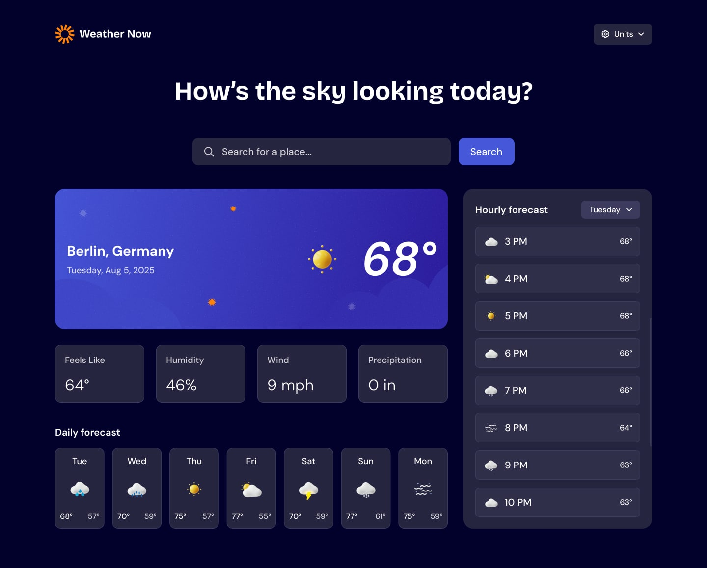

# Weather App

A modern, elegant, and responsive weather application built with React and Tailwind CSS. Instantly search for any location, view current weather, daily and hourly forecasts, and manage your favorite places. Supports both dark and light themes for a beautiful experience on any device.

---

## ✨ Features

- **Live Weather Search:**
  - Search for any city or place and get instant weather updates.
  - See suggestions as you type with a smooth autocomplete dropdown.
- **Current Weather:**
  - View temperature, humidity, wind speed, precipitation, and weather icons.
- **Daily & Hourly Forecasts:**
  - Detailed daily and hourly weather breakdowns.
- **Favorites:**
  - Save and quickly switch between your favorite locations.
- **Unit Switching:**
  - Toggle between metric and imperial units for temperature, wind, and precipitation.
- **Theme Toggle:**
  - Switch between elegant light and dark modes with a single click.
- **Responsive Design:**
  - Looks great on desktop, tablet, and mobile.
- **Graceful Fallbacks:**
  - Handles geolocation errors and no-result states with clear UI feedback.

---

## 🖼️ Screenshots

| Light Mode | Dark Mode |
|------------|-----------|
|  |  |

---

## 🚀 Getting Started

### Prerequisites
- [Node.js](https://nodejs.org/) (v16+ recommended)
- [npm](https://www.npmjs.com/) or [yarn](https://yarnpkg.com/)

### Installation

```bash
# Clone the repository
$ git clone https://github.com/your-username/weather-app.git
$ cd weather-app

# Install dependencies
$ npm install
# or
yarn install
```

### Running the App

```bash
# Start the development server
$ npm run dev
# or
yarn dev
```

The app will be available at [http://localhost:5173](http://localhost:5173) (or the port shown in your terminal).

---

## 🛠️ Project Structure

```
weather-app/
├── public/
│   └── images/           # Weather icons, backgrounds, and assets
│   └── design/           # Design reference images
├── src/
│   ├── components/       # React components (NavBar, Loading, etc.)
│   ├── App.jsx           # Main app logic and UI
│   ├── index.jsx         # Entry point
│   └── index.css         # Tailwind CSS imports
├── package.json
├── tailwind.config.js
├── vite.config.js
└── README.md
```

---

## 🌐 APIs & Data
- [Open-Meteo Weather API](https://open-meteo.com/)
- [Open-Meteo Geocoding API](https://open-meteo.com/en/docs/geocoding-api)
- [OpenStreetMap Nominatim](https://nominatim.openstreetmap.org/)

---

## 🎨 Customization
- **Themes:** Easily adjust colors in `tailwind.config.js` or component classes.
- **Units:** Add more units or localization as needed.
- **Design:** Swap out images in `public/images` for your own branding.

---

## 🤝 Contributing

1. Fork the repository
2. Create your feature branch (`git checkout -b feature/YourFeature`)
3. Commit your changes (`git commit -am 'Add some feature'`)
4. Push to the branch (`git push origin feature/YourFeature`)
5. Open a Pull Request

---

## 📄 License

This project is licensed under the MIT License.

---

## 🙏 Acknowledgements
- Weather data by [Open-Meteo](https://open-meteo.com/)
- Geocoding by [OpenStreetMap Nominatim](https://nominatim.openstreetmap.org/)
- UI inspired by modern weather apps and community feedback.

---

> Made with ❤️ by Abel
